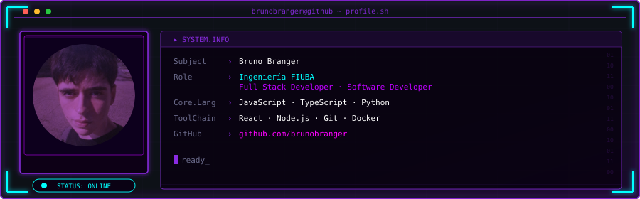
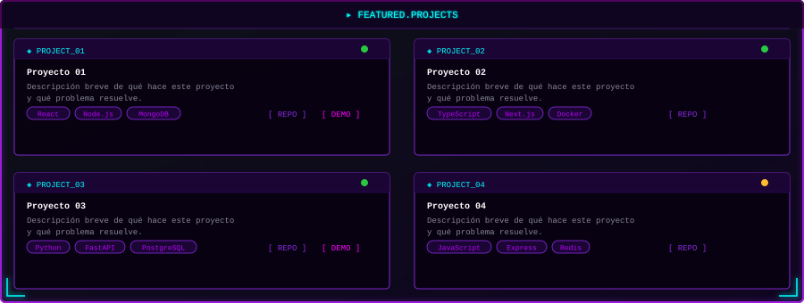

<!-- ═══════════════════════════════════════════════════════════════════ -->
<!--  brunobranger — GitHub Profile README · Cyberpunk Terminal Neon   -->
<!-- ═══════════════════════════════════════════════════════════════════ -->

<!-- ── 1. ANIMATED HEADER ── -->
<div align="center">

</div>

<br/>

<!-- ── 2. METRICS ── -->
<div align="center">


<br/>


<br/>


</div>

<br/>

<!-- ── 3. SNAKE ANIMATION ── -->
<div align="center">

<picture>
  <source media="(prefers-color-scheme: dark)"  srcset="https://raw.githubusercontent.com/brunobranger/brunobranger/output/snake-dark.svg"/>
  <source media="(prefers-color-scheme: light)" srcset="https://raw.githubusercontent.com/brunobranger/brunobranger/output/snake-light.svg"/>
  
</picture>

</div>

<br/>

<!-- ── 4. TECH STACK ── -->
<div align="center">

```
[ TECH.STACK ]
```


</div>

<br/>

<!-- ── 5. FEATURED PROJECTS ── -->
<div align="center">

</div>

<br/>

<!-- ── 6. FOOTER & SOCIAL ── -->
<div align="center">

[](https://linkedin.com/in/brunobranger)
&nbsp;
[](https://brunobranger.dev)
&nbsp;
[](mailto:brunobranger@gmail.com)

<br/><br/>


<br/>


```
> brunobranger@github:~$ _
```

</div>
<!-- ═══════════════════════════════════════════════════════════════════ -->
